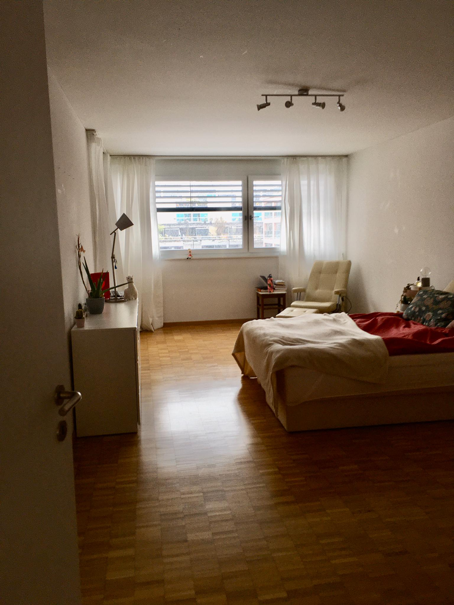
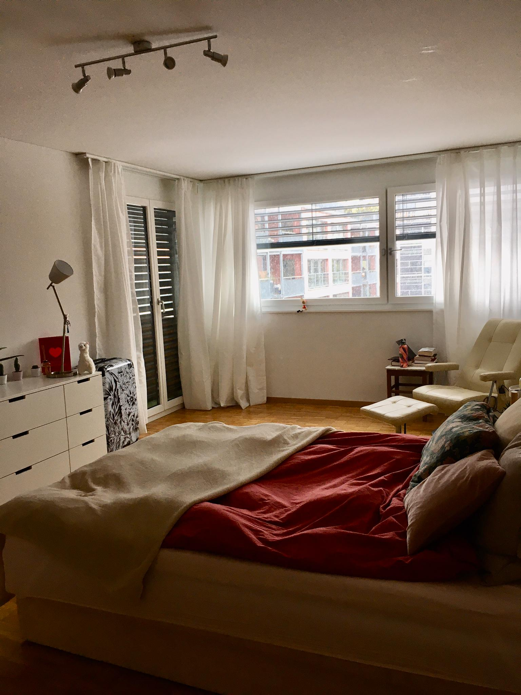
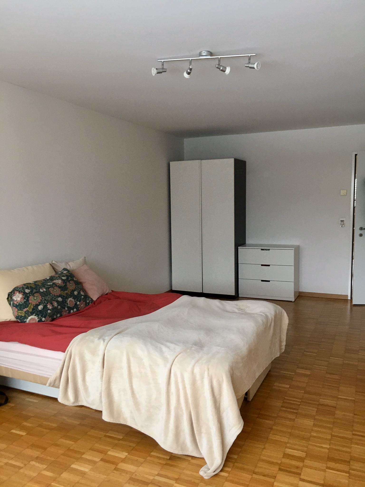
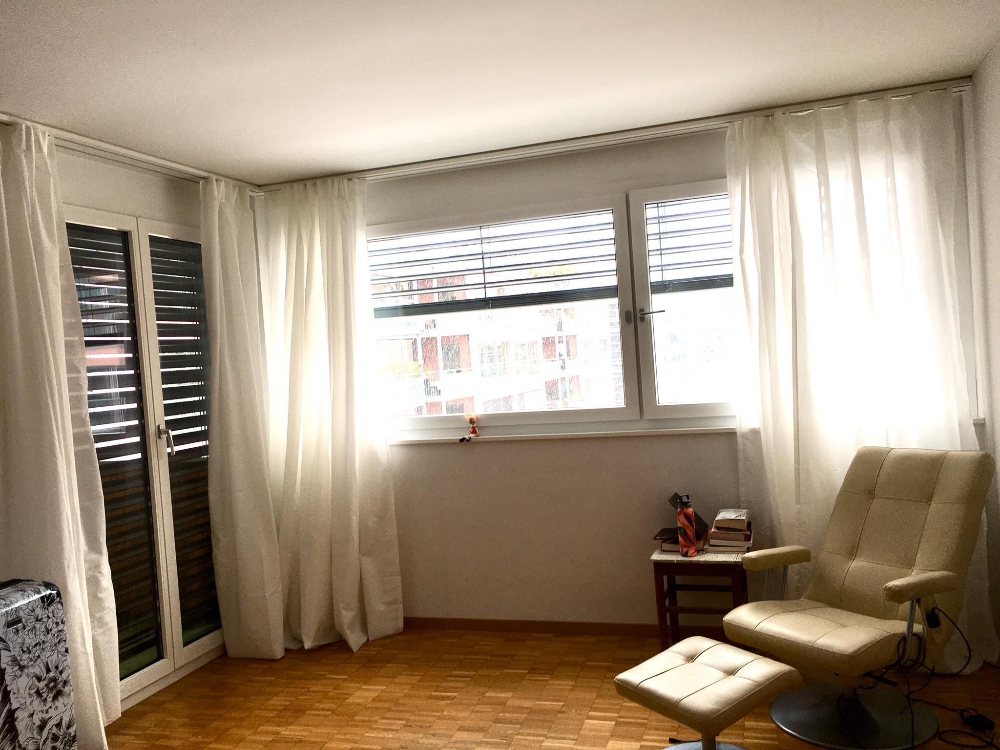
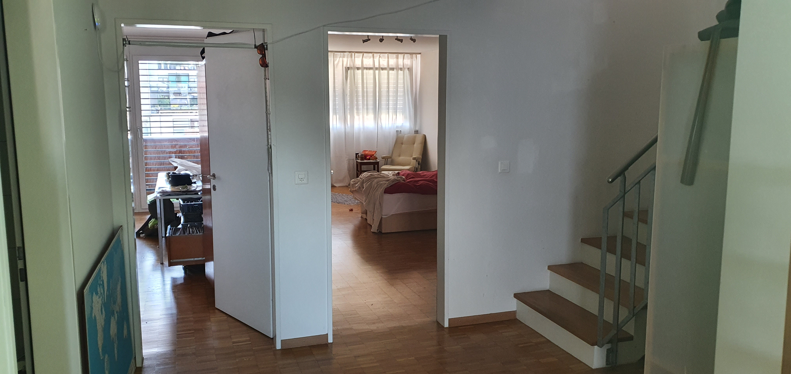
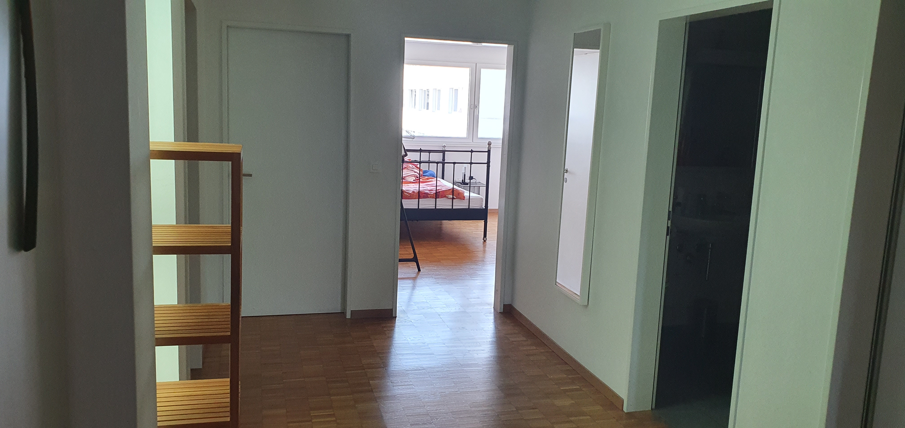
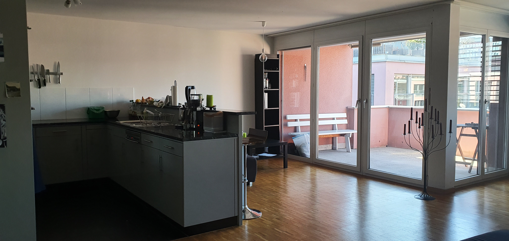
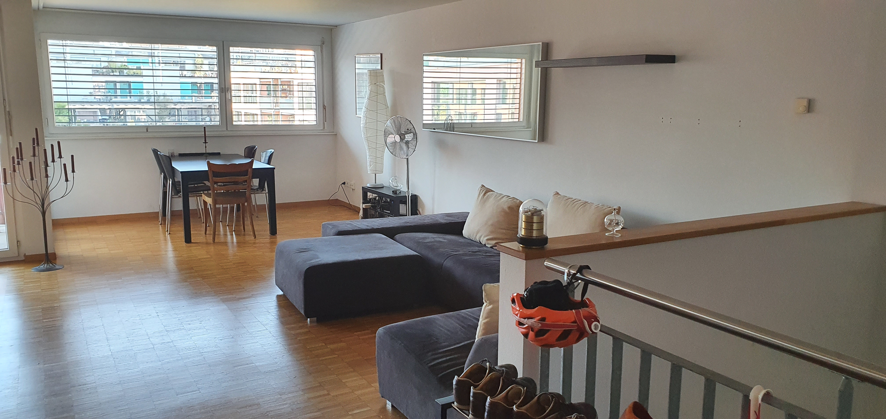

### [Heinrichstrasse 255 — nahe Escher-Wyss-Platz](https://goo.gl/maps/5M6nC61x44gEojCz6)

Da unsere aktuelle Mitbewohnerin auswandert, suchen wir eine Mitbewohnerin oder einen Mitbewohner.

**Wann**: 1. Mai 2020  
**Wo**: [Heinrichstrasse 255 - Google Maps](https://goo.gl/maps/5M6nC61x44gEojCz6)  
**Miete**: CHF 1200.-/Monat

### Die Wohnung / Das Zimmer

#### Zimmer

- **Fläche**: 25m²
- Badezimmer geteilt mit einem Mitbewohner

Das WG Zimmer ist unmöbliert - einzelne Möbelstücke können von der Vormieterin übernommen werden.

[Bilder des Zimmers](#zimmer-1)

#### Ganze Wohnung

- **Fläche**: 177m²
- 5½ Zimmer
- Maisonett (2 Stockwerke) | 4. und 5. Stock | Eingang im 5. Stock
- sehr zentrale Lage (Escher-Wyss-Platz, Hardbrücke), trotzdem verhältnismässig ruhig
- ganze Wohnung ausser Küche und Bäder Parkettböden mit Bodenheizung
- eigene Waschmaschine und Tumbler
- grosszügige Wohnküche mit Geschirrspüler
- 2 Badezimmer plus extra Toilette in der eigenen Waschküche
- Gästezimmer mit Bett etc.
- Zugang zu riesiger Dachterrasse (geteilt mit ganzem Haus)
- Kellerabteil vorhanden
- Haus hat gemeinsamen Fahrrad-Raum

[Bilder der Wohnung](#die-wohnung)

#### Allgemeines

Wir haben eine Reinigungskraft die uns alle 14 Tage die Grundreinigung macht. Selbsterklärend ergibt das nur die Grundlage, bei Bedarf legen wir spontan selber Hand an.

#### Kosten

- **Miete**: CHF 1200.- Monat
- **Reinigungskraft**: ca. CHF 120.-/Monat
- Internet CHF 259.- im Jahr | Glasfaser 1 GB/1 GB | Wi-Fi Infrastruktur ist vorhanden
- Normale jährlich anfallende Nebenkosten wie Elektrizität und dergleichen (vergleichsweise kleine Beträge einmal pro Jahr, im üblichen Rahmen)
- 2 Monate Miet-Pfand

### Wir sind

Fabian (30 J), Chemiker

Kaspar (39 J), Programmierer

Wir arbeiten viel, _der eine sogar extrem viel_ (macht phd in Chemie…).

Wir sind also nicht konstant auf plan und präsent für Aktivitäten. Solltest du also die grosse Party WG suchen, können wir dir sehr nur bedingt weiter helfen.
Unsere etwas atypischen Tagesabläufe machen gemeinsame Esskultur auch etwas schwierig. Ich (Kaspar) wäre aber gerne bereit sporadisch einen kleinen Kulturwandel zu machen (sprich mal was zusammen zu kochen & essen).

### Wir suchen

Du befindest dich irgendwo Handgelenk mal Pi Spektrum unseres Alters.

Das die Putzfrau alle 14 Tage nicht 100 % der Reinigung erledigen kann ist dir klar, darum bist du in der Lage ohne Putzplan und Tätersuche auch mal unkompliziert ein Malheur aus deinem Weg zu schaffen. ;-)

Du bist gerne für einen Schwatz oder anderes zu haben, gehst aber auch nicht gleich ein, wenn deine Mitbewohner mal nicht präsent sind (wir arbeiten viel, und sehr viel, um noch ein bisschen drauf herum zu reiten).

### Kontakt

<a href="mailto:vollenweider+wgzimmer@gmail.com">vollenweider+wgzimmer@gmail.com</a>

### Bilder

#### Zimmer

#### Die Wohnung

